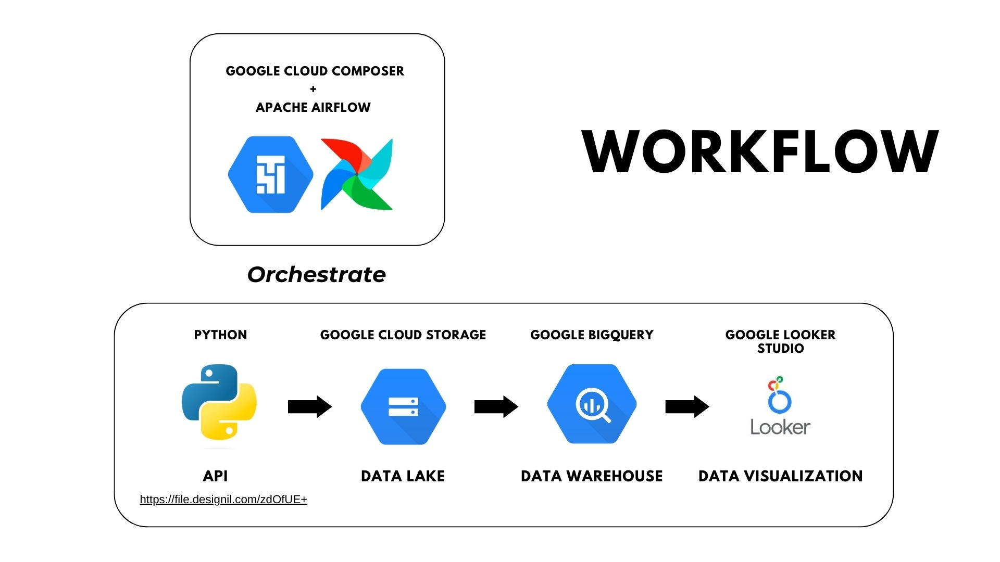

## Project's Description
Ingest data from API with **Python** , store raw data in **Google Cloud Storage** , build data pipeline with **Apache Spark** , load data into **Google BigQuery** then create dashboard with **Google Looker Studio**

## Data Lake - Google Cloud Storage
1. Create Project
2. Create Bucket (can create with either UI or CLI gsutil)
   - Select data center : Singapore.
   - Others settings is default
3. Go in bucket and upload the file (can upload with UI or CLI gsutil or Python SDK)

gsutil documentaion : https://cloud.google.com/storage/docs/gsutil

## Data Pipeline - Cloud Composer + Apache Airflow + DAGs
**Cloud Composer** is fully-managed Apache Airflow 
1. Go to **Cloud Composer** in **Google Cloud Console**
2. Create **Cloud Composer 1**
   - name an environment
   - Location (nearest from your country) : us-central1
   - Machine type : n1-standard-2 (RAM 7.5 GB)
   - Disk Size : 20 GB
   - Image Version : select the latest
   - Python version : 3
   - leave others settings default
